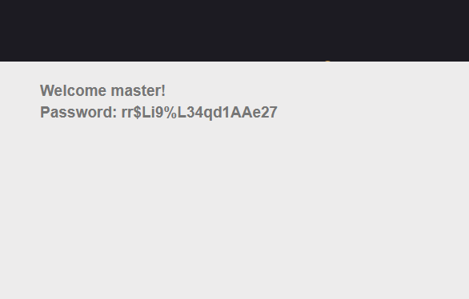

1. I use Firefox so direct to `about:config`
2. Then add "general.user.agent.override"
3. After that set "user agent" to "admin" like in this picture

4. Turn back this web `http://challenge01.root-me.org/web-serveur/ch2/`, reload it we have password
