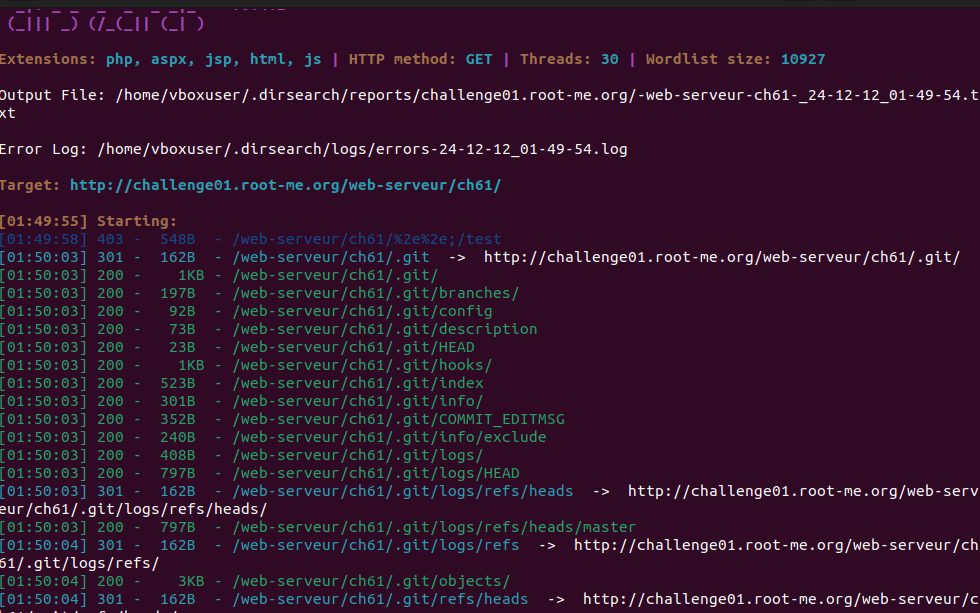
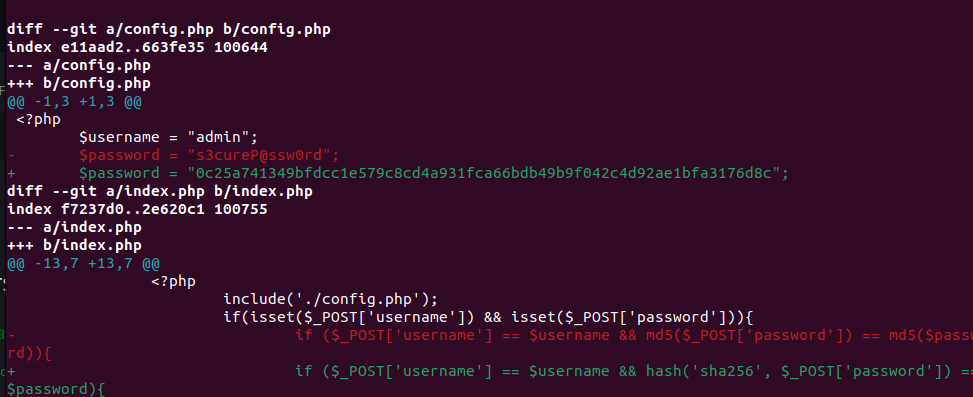

1. First I use `dirsearch` to scan. Here's the result

- Use `wget -r http://challenge01.root-me.org/web-serveur/ch61/.git/`
- Access `.git` file after dowload successfully. Use `git show` you can see these:

- The flag is :)