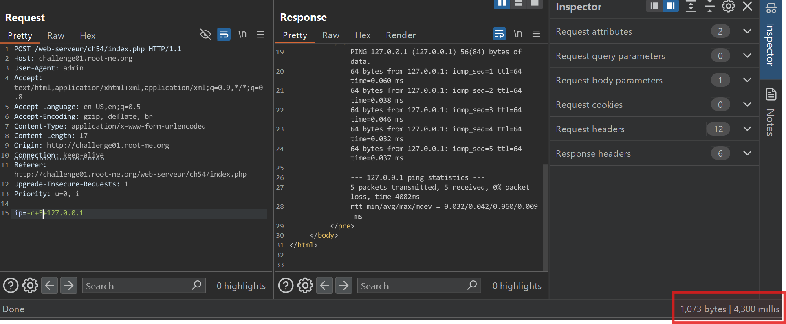

1. When fill out the blank, I receive this

2. Look! It's `PING 127.0.0.1`. It remind me OS Command injection. I think in here it use `ping ip`.
3. I try `ip=-c+5+127.0.0.1` and it delays

4. As its reponse show in the page, we can use this to exploit `127.0.0.1;cat 'index.php'`

5. Here's response

The password can be in `.passwd`
I try this `127.0.0.1;cat '\.passwd'`

The flag is `S3rv1ceP1n9Sup3rS3cure`